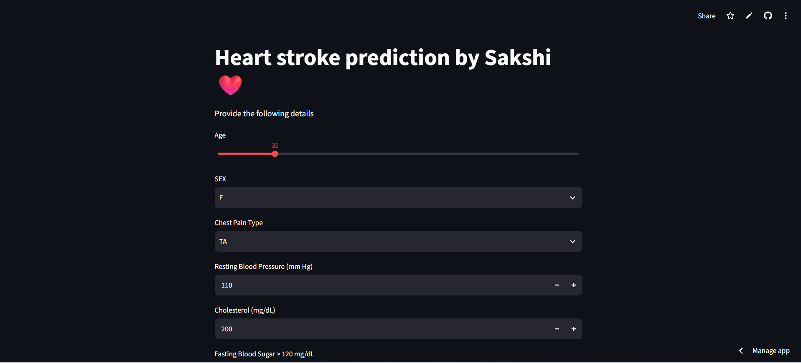
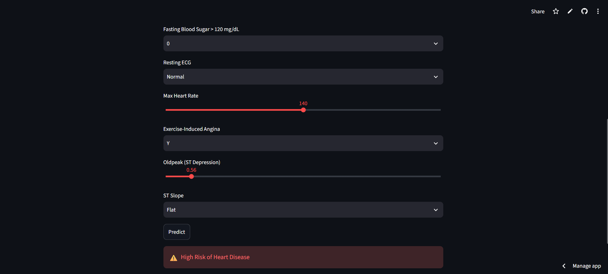

# ❤️ Heart Disease Prediction

A Machine Learning web application that predicts the possibility of heart disease using the **K-Nearest Neighbors (KNN)** classification algorithm.

## 🚀 Live Demo

👉 [Open the Live App](https://heart-disease-prediction-bhtaj7yfxbr85fkbux2ukn.streamlit.app/)

## 📌 Project Overview

This project uses Machine Learning to predict whether a person is likely to have heart disease based on selected health-related parameters.

The application is built using **Streamlit**, providing an interactive interface where users can enter health-related information and receive a prediction.

The project demonstrates the complete Machine Learning workflow, including:

- Data preprocessing
- Feature scaling
- KNN classification
- Model serialization using Joblib
- Interactive web application using Streamlit
- Cloud deployment

## 🛠️ Technologies Used

- Python
- Pandas
- Scikit-learn
- Joblib
- Streamlit
- Machine Learning

## 🤖 Machine Learning Model

The project uses the **K-Nearest Neighbors (KNN)** classification algorithm.

The input features are scaled using **StandardScaler** before making predictions so that features with different numerical ranges can be handled appropriately.

### Model Files

- `KNN_heart.pkl` – Trained KNN classification model
- `scaler.pkl` – Saved StandardScaler
- `columns.pkl` – Saved feature/column information

## 📊 Input Features

| Feature | Description |
|---|---|
| Age | Age of the patient |
| Sex | Biological sex |
| Chest Pain Type | Type of chest pain |
| Resting Blood Pressure | Resting blood pressure |
| Cholesterol | Serum cholesterol level |
| Fasting Blood Sugar | Fasting blood sugar category |
| Resting ECG | Resting electrocardiogram result |
| Maximum Heart Rate | Maximum heart rate achieved |
| Exercise-Induced Angina | Whether angina occurs during exercise |
| Oldpeak | ST depression value |
| ST Slope | Slope of the peak exercise ST segment |

## 🖥️ Application

The Streamlit application provides an easy-to-use interface where users can enter the required health-related parameters and receive a prediction from the trained KNN model.

### Application Interface



### Prediction Result



## 📁 Project Structure

```text
heart-disease-prediction/
│
├── app.py
├── KNN_heart.pkl
├── scaler.pkl
├── columns.pkl
├── requirements.txt
├── README.md
├── app-interface.png
└── prediction-result.png
```

## ▶️ Run Locally

Clone the repository and install the required dependencies:

```bash
pip install -r requirements.txt
```

Run the Streamlit application:

```bash
streamlit run app.py
```

## 🌐 Deployment

The application is deployed using **Streamlit Community Cloud**.

👉 [View Live Application](https://heart-disease-prediction-bhtaj7yfxbr85fkbux2ukn.streamlit.app/)

## 🎯 Project Objectives

- Apply Machine Learning to a real-world healthcare-related dataset
- Understand KNN classification
- Perform feature scaling and preprocessing
- Build an interactive Streamlit application
- Deploy a Machine Learning model online

## 🔮 Future Improvements

- Add model performance metrics
- Add multiple Machine Learning models for comparison
- Improve UI design
- Add prediction probability
- Add data visualization

## ⚠️ Disclaimer

This application is developed for **educational and demonstration purposes only**. It is not intended to provide medical diagnosis or replace professional medical advice.

## 👩‍💻 Author

**Sakshi Yadav**

Data Scientist


⭐ If you find this project useful, consider giving the repository a star!
